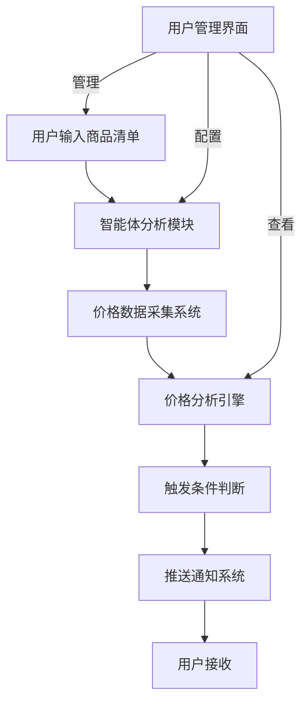

# 🛒 价格监控智能体设计方案

> **设计时间**: 2026-07-13  
> **设计者**: Hermes Agent  
> **状态**: 设计完成，待实施  
> **需求触发**: 用户需求讨论

---

## 🎯 核心功能概述

一个智能的价格监控系统，能够自动监控商品价格变化，识别历史最低价，检测优惠活动，并智能推送价格提醒。

### 🔥 核心价值
- **24/7自动监控** - 不间断监控价格变化
- **智能分析** - AI驱动的价格趋势分析和优惠检测
- **及时通知** - 价格达到触发条件时立即推送
- **多平台对比** - 在不同平台间找到最优惠价格
- **个性化设置** - 用户可以自定义监控策略

---

## 📋 系统架构设计



### 系统组件

| 组件 | 功能 | 技术实现 |
|------|------|----------|
| **用户输入界面** | 支持文本、CSV、URL等多种输入方式 | Python CLI / Web界面 / 浏览器插件 |
| **智能体分析模块** | AI商品识别、价格区间设定、监控策略设定 | LLM + 规则引擎 |
| **价格数据采集系统** | 从电商平台采集价格数据 | Scrapy/Requests + 反爬虫策略 |
| **价格分析引擎** | 趋势分析、优惠检测、平台对比 | Pandas/Numpy + 机器学习 |
| **触发条件判断** | 基于降价幅度、优惠力度等触发推送 | 规则引擎 + 条件判断 |
| **推送通知系统** | 多渠道推送通知 | 微信API/Email/DingTalk API |
| **用户管理界面** | 商品清单管理、监控策略设置、统计分析 | Web界面 / 移动端APP |

---

## 🛠️ 详细功能设计

### 1. 用户输入界面

#### 支持的输入方式
- 📝 **文本清单** - 直接输入商品名称
- 🛒 **购物车导入** - 从淘宝、京东等平台导入
- 📊 **CSV文件** - 上传商品清单文件
- 🔗 **URL链接** - 直接分析商品页面

#### 示例输入
```
1. iPhone 15 Pro 256GB 自然钛色
2. MacBook Air M2 13寸 8G+256G
3. 戴森 V15 吸尘器
4. 索尼 WH-1000XM5 耳机
```

#### AI分析能力
- ✅ 理解商品型号和规格
- ✅ 识别同款不同版本
- ✅ 推荐合理的价格区间
- ✅ 设置个性化监控策略

---

### 2. 智能体分析模块

#### 商品识别
```python
class ProductRecognizer:
    def recognize_product(self, input_text):
        """从输入中提取商品信息"""
        # 使用NLP分析商品名称
        # 提取品牌、型号、规格、颜色等
        # 返回结构化的商品信息
        pass
```

#### 价格区间设定
```python
class PriceRangeAnalyzer:
    def set_price_range(self, product_info):
        """根据商品类型设置合理价格区间"""
        # 基于商品类别设置期望价格区间
        # 考虑市场平均价格
        # 设置价格波动阈值
        pass
```

#### 监控策略设定
```python
class MonitoringStrategy:
    def configure_monitoring(self, user_prefs):
        """设置个性化监控策略"""
        # 设置检查频率（每天/每周/实时）
        # 设置推送条件（降价幅度、绝对价格等）
        # 设置优先级和通知渠道
        pass
```

---

### 3. 价格数据采集系统

#### 数据源
- 🛍️ **电商平台**: 淘宝、京东、拼多多、苏宁、国美
- 📱 **海外平台**: Amazon、eBay、AliExpress
- 🛒 **比价网站**: 比价网、惠惠、什么值得买
- 📊 **官方旗舰店**: 品牌官方商城

#### 采集策略
- 🔄 **定时采集**: 每天/每周固定时间检查
- 🚀 **实时监控**: 重要商品实时价格更新
- 📈 **历史数据存储**: 保存价格变化轨迹
- 🔍 **多平台对比**: 同款商品不同平台价格对比

#### 采集方法
- 🛍️ **官方API** (如果可用)
- 🕷️ **网页抓取** (Scrapy/Selenium)
- 📊 **第三方数据源** (比价网站API)
- 🤖 **模拟浏览器** (Puppeteer/Playwright)

---

### 4. 价格分析引擎

#### 核心功能

##### 历史价格对比
```python
def find_historical_low(prices):
    """找到历史最低价"""
    if not prices:
        return None
    
    # 过滤异常值
    filtered_prices = [p for p in prices if abs(p - np.mean(prices)) < 3 * np.std(prices)]
    return min(filtered_prices) if filtered_prices else None
```

##### 降价幅度计算
```python
def calculate_price_drop(current_price, historical_low):
    """计算降价幅度"""
    if historical_low is None:
        return 0
    
    drop_amount = historical_low - current_price
    drop_percentage = (drop_amount / historical_low) * 100
    
    return {
        'amount': round(drop_amount, 2),
        'percentage': round(drop_percentage, 1),
        'is_significant': drop_percentage >= 10
    }
```

##### 优惠活动检测
```python
def detect_discount_activities(price_info):
    """检测优惠活动"""
    activities = []
    
    # 检测满减活动
    if 'original_price' in price_info and 'current_price' in price_info:
        original = price_info['original_price']
        current = price_info['current_price']
        if original > current:
            discount = original - current
            activities.append({
                'type': '满减活动',
                'amount': round(discount, 2),
                'percentage': round((discount / original) * 100, 1)
            })
    
    # 检测优惠券
    if price_info.get('coupon_available', False):
        activities.append({
            'type': '优惠券',
            'value': price_info.get('coupon_value', '未知')
        })
    
    # 检测限时秒杀
    if price_info.get('is_limited_time', False):
        activities.append({
            'type': '限时秒杀',
            'ends_at': price_info.get('ends_at')
        })
    
    return activities
```

##### 价格趋势分析
```python
def analyze_price_trend(prices):
    """分析价格趋势"""
    if len(prices) < 3:
        return {'trend': 'insufficient_data', 'confidence': 0}
    
    # 简单线性回归分析
    x = np.arange(len(prices))
    y = prices
    slope, intercept, r_value, p_value, std_err = linregress(x, y)
    
    trend = 'downward' if slope < 0 else 'upward' if slope > 0 else 'stable'
    confidence = abs(r_value)
    
    return {
        'trend': trend,
        'slope': round(slope, 4),
        'r_squared': round(r_value**2, 4),
        'confidence': round(confidence * 100, 1),
        'prediction': intercept + slope * (len(prices) + 7)
    }
```

---

### 5. 触发条件判断

#### 推送触发条件

| 触发条件 | 条件描述 | 优先级 |
|---------|----------|--------|
| **价格降低** | 低于历史最低价15% | 🔥 高 |
| **优惠活动** | 检测到大促、优惠券 | 🔥 高 |
| **限时优惠** | 即将结束的限时优惠 | 🔥 高 |
| **价格趋势** | 价格持续下跌趋势 | ⚡ 中 |
| **个性化设置** | 用户自定义触发条件 | 📌 低 |

#### 触发阈值示例
```
- 降价幅度 ≥ 15% 且 绝对价格 ≤ 1000元 → 立即推送
- 降价幅度 ≥ 20% → 立即推送
- 价格低于历史最低价 → 立即推送
- 优惠券满减 ≥ 50元 → 立即推送
- 限时秒杀即将结束（30分钟内）→ 立即推送
```

---

### 6. 推送通知系统

#### 推送渠道
- 📱 **手机APP通知**
- 📧 **邮件推送**
- 💬 **微信/企业微信**
- 📱 **钉钉**
- 🔔 **桌面通知**

#### 推送内容格式
```
🎉 价格提醒！您关注的商品价格已降至历史低位！

📦 商品信息：
- 名称：{product_name}
- 当前价格：￥{current_price}
- 历史最低价：￥{historical_low}（{date}）
- 降价幅度：{percentage}%（原价￥{original_price}）
- 平台：{platform}
- 优惠信息：{discount_info}

🔗 购买链接：{purchase_url}
⏰ 优惠截止：{expiry_date}

💡 建议：价格已达历史低位，建议立即购买！
```

---

### 7. 用户管理界面

#### 功能模块

##### 商品清单管理
- ✅ 添加商品
- ✅ 删除商品
- ✅ 编辑商品信息
- ✅ 批量导入导出
- ✅ 搜索和过滤

##### 监控策略设置
- ⏰ 设置检查频率
- 🎯 设置触发条件
- 📱 设置推送渠道
- 🔕 设置免打扰时间
- 🌍 设置地理区域偏好

##### 价格历史查看
- 📈 价格变化曲线图
- 📊 价格统计分析
- 🔍 历史价格对比
- 📉 趋势分析报告

##### 统计分析
- 📊 监控效果统计
- 💰 节省金额统计
- ⏰ 平均响应时间
- 📈 价格波动分析

---

## 🚀 技术实现方案

### 后端架构

```
智能体核心 (Python)
├── 价格采集模块 (Scrapy/Requests)
├── 数据分析模块 (Pandas/Numpy)
├── AI分析模块 (LLM + 规则引擎)
├── 数据库 (PostgreSQL/SQLite)
├── 任务调度 (Celery/Airflow)
├── API服务 (FastAPI/Flask)
└── 推送服务 (WeChat API/Email)
```

### 数据库设计

#### Products表
```sql
CREATE TABLE products (
    id SERIAL PRIMARY KEY,
    user_id VARCHAR(64) NOT NULL,
    name TEXT NOT NULL,
    model TEXT,
    category VARCHAR(64),
    target_price DECIMAL(10,2),
    min_price DECIMAL(10,2),
    max_price DECIMAL(10,2),
    current_price DECIMAL(10,2),
    price_history JSONB,
    created_at TIMESTAMP,
    updated_at TIMESTAMP
);
```

#### PriceRecords表
```sql
CREATE TABLE price_records (
    id SERIAL PRIMARY KEY,
    product_id INTEGER REFERENCES products(id),
    platform VARCHAR(64),
    price DECIMAL(10,2),
    original_price DECIMAL(10,2),
    discount DECIMAL(10,2),
    coupon_available BOOLEAN,
    stock_status VARCHAR(32),
    record_time TIMESTAMP,
    url TEXT
);
```

#### MonitoringTasks表
```sql
CREATE TABLE monitoring_tasks (
    id SERIAL PRIMARY KEY,
    product_id INTEGER REFERENCES products(id),
    frequency VARCHAR(32),  -- daily, weekly, realtime
    last_checked TIMESTAMP,
    next_check TIMESTAMP,
    is_active BOOLEAN,
    created_at TIMESTAMP
);
```

#### Users表
```sql
CREATE TABLE users (
    user_id VARCHAR(64) PRIMARY KEY,
    email VARCHAR(128),
    phone VARCHAR(32),
    wechat_id VARCHAR(64),
    notification_preferences JSONB,
    created_at TIMESTAMP
);
```

---

## 📊 实施路线图

### 阶段1：基础功能开发（2-3周）
- [ ] 价格采集模块开发
- [ ] 基础数据库设计和实现
- [ ] 简单的价格对比功能
- [ ] 手动商品添加界面
- [ ] 基础推送功能

### 阶段2：智能分析增强（1-2周）
- [ ] AI商品识别和分类
- [ ] 价格趋势分析算法
- [ ] 优惠活动检测
- [ ] 用户偏好学习
- [ ] 智能推荐系统

### 阶段3：平台扩展（2-3周）
- [ ] 添加更多电商平台支持
- [ ] 移动端APP开发
- [ ] 浏览器插件集成
- [ ] 微信小程序
- [ ] API接口开放

### 阶段4：高级功能（持续）
- [ ] 价格预测模型
- [ ] 团购组织功能
- [ ] 社交分享功能
- [ ] 机器学习优化
- [ ] 企业级功能

---

## 💡 创意增强功能

### 智能购物助手
```python
class SmartShoppingAssistant:
    def __init__(self):
        self.preferences = {}  # 用户购物偏好
        self.budget = {}      # 预算设置
        self.purchase_history = []  # 购买历史
    
    def recommend_purchases(self):
        """基于用户偏好推荐购买时机"""
        # 分析用户购买历史
        # 学习用户购物习惯
        # 推荐最佳购买时机
        pass
    
    def budget_alert(self):
        """预算提醒"""
        # 当价格低于预算时提醒
        # 当价格即将上涨时提醒
        pass
```

### 团购组织功能
```python
class GroupPurchaseOrganizer:
    def __init__(self):
        self.groups = {}  # 团购群组
    
    def create_group(self, product_name, target_price):
        """创建团购群组"""
        # 邀请其他用户加入
        # 协调团购数量
        # 谈判更优惠价格
        pass
    
    def join_group(self, group_id):
        """加入团购"""
        # 确认团购条款
        # 确认支付方式
        # 获取团购链接
        pass
```

### 价格预测模型
```python
class PricePredictor:
    def __init__(self):
        self.model = None  # 机器学习模型
    
    def train_model(self, historical_data):
        """训练价格预测模型"""
        # 使用LSTM网络
        # 考虑季节性因素
        # 结合节假日影响
        pass
    
    def predict_future_price(self, product_id, days=7):
        """预测未来价格"""
        # 返回价格预测和置信区间
        pass
    
    def alert_price_drop(self):
        """预测价格下跌时提前通知"""
        # 当预测价格即将下跌时提前通知
        # 给出购买建议
        pass
```

---

## 🛡️ 风险控制和合规

### 反爬虫和合规
- ✅ **遵守Robots.txt** - 尊重网站规则
- ✅ **限制请求频率** - 避免过度访问
- ✅ **使用官方API** - 优先使用官方数据接口
- ✅ **数据存储合规** - 遵守数据保护法规
- ✅ **用户隐私保护** - 匿名化处理用户数据

### 价格数据准确性
- 🔄 **多平台验证** - 同款商品多平台对比
- 📊 **历史数据校验** - 与历史价格趋势对比
- 🤖 **异常值检测** - 过滤价格异常波动
- 📈 **趋势分析** - 结合价格趋势预测

### 用户体验优化
- 🎯 **个性化设置** - 用户可以自定义监控条件
- 📱 **多平台推送** - 支持多种推送方式
- 🔍 **搜索和过滤** - 方便用户管理商品清单
- 📊 **统计分析** - 提供价格监控效果统计
- 💬 **智能推荐** - 基于用户行为推荐商品

---

## 📈 商业模式设想

### 免费版功能
- 基础价格监控
- 简单的价格对比
- 邮件推送
- 有限的商品数量
- 基础统计分析

### 高级版功能（付费）
- 实时价格监控
- 多平台价格对比
- 智能购买建议
- 团购组织功能
- 价格预测模型
- 移动端APP
- API接口访问
- 高级统计分析
- 优先级推送

### 企业版功能
- 批量商品管理
- 团队账号管理
- 企业级数据分析
- 定制化开发
- 专属客户支持
- 数据导出和分析
- 多用户权限管理
- 企业级安全保障

---

## 🔧 技术栈推荐

### 后端技术栈
- **语言**: Python 3.11+
- **Web框架**: FastAPI (推荐) / Flask
- **任务调度**: Celery + Redis
- **数据库**: PostgreSQL (推荐) / SQLite (简单)
- **价格采集**: Scrapy / Requests + Selenium
- **AI分析**: Pandas / NumPy / scikit-learn
- **推送服务**: 微信企业号API / 企业微信群机器人 / Email API
- **部署**: Docker + Nginx + Gunicorn
- **监控**: Prometheus + Grafana
- **日志**: ELK Stack (Elasticsearch + Logstash + Kibana)

### 前端技术栈
- **Web界面**: React.js / Vue.js / Svelte
- **移动端**: React Native / Flutter
- **浏览器插件**: Chrome Extension / Firefox Add-on
- **微信小程序**: 微信小程序框架

### 第三方服务
- **云服务器**: 阿里云 / 腾讯云 / AWS / 华为云
- **数据库托管**: 云数据库服务
- **消息队列**: Redis / RabbitMQ
- **CDN加速**: 静态资源加速

---

## 📝 备注和建议

### 开发建议
1. **先实现基础版** - 从核心功能开始，逐步添加高级功能
2. **模块化设计** - 每个组件独立开发，便于维护和扩展
3. **测试驱动开发** - 先写测试用例，再实现功能
4. **日志记录** - 完整的日志记录，便于调试和监控
5. **错误处理** - 完善的错误处理机制，提高系统稳定性

### 部署建议
1. **容器化部署** - 使用Docker容器，便于部署和迁移
2. **负载均衡** - 使用Nginx作为反向代理和负载均衡
3. **监控告警** - 部署监控系统，及时发现问题
4. **备份策略** - 定期备份数据库和重要文件
5. **安全加固** - 网络安全、数据安全、用户隐私保护

### 运营建议
1. **用户反馈** - 建立用户反馈渠道，持续改进产品
2. **功能迭代** - 根据用户需求快速迭代功能
3. **社区建设** - 建立用户社区，促进用户交流
4. **推广策略** - 制定合理的推广策略，获取更多用户
5. **商业化** - 逐步推出付费功能，实现可持续发展

---

## 🎯 总结

这个价格监控智能体设计方案提供了一个完整的系统架构和实施路线图。系统具有以下特点：

### 核心优势
- ✅ **全面的功能覆盖** - 从数据采集到智能分析，功能完整
- ✅ **灵活的架构设计** - 模块化设计，便于扩展和维护
- ✅ **智能化分析** - AI驱动的价格趋势分析和优惠检测
- ✅ **用户友好** - 个性化设置，多渠道推送，便捷的用户体验
- ✅ **可扩展性强** - 支持多平台、多功能的扩展

### 实施建议
1. **从基础版开始** - 先实现核心功能，验证市场需求
2. **快速迭代** - 根据用户反馈快速改进和优化
3. **关注用户体验** - 便捷的操作界面和及时的推送通知
4. **保障数据准确性** - 多平台验证，避免误报
5. **合规运营** - 遵守相关法规，保护用户隐私

### 期望效果
这个系统将帮助用户：
- 💰 **节省金钱** - 及时发现最优惠价格，避免高价购买
- ⏰ **节省时间** - 自动监控，无需手动检查价格
- 📊 **做出明智决策** - 基于数据分析的购买建议
- 🎯 **提升购物体验** - 智能推荐和个性化设置

---

**📌 设计状态**: ✅ 设计完成，待实施  
**📅 设计时间**: 2026-07-13  
**👤 设计者**: Hermes Agent  
**🔖 标签**: #价格监控 #智能体 #设计方案 #备忘录