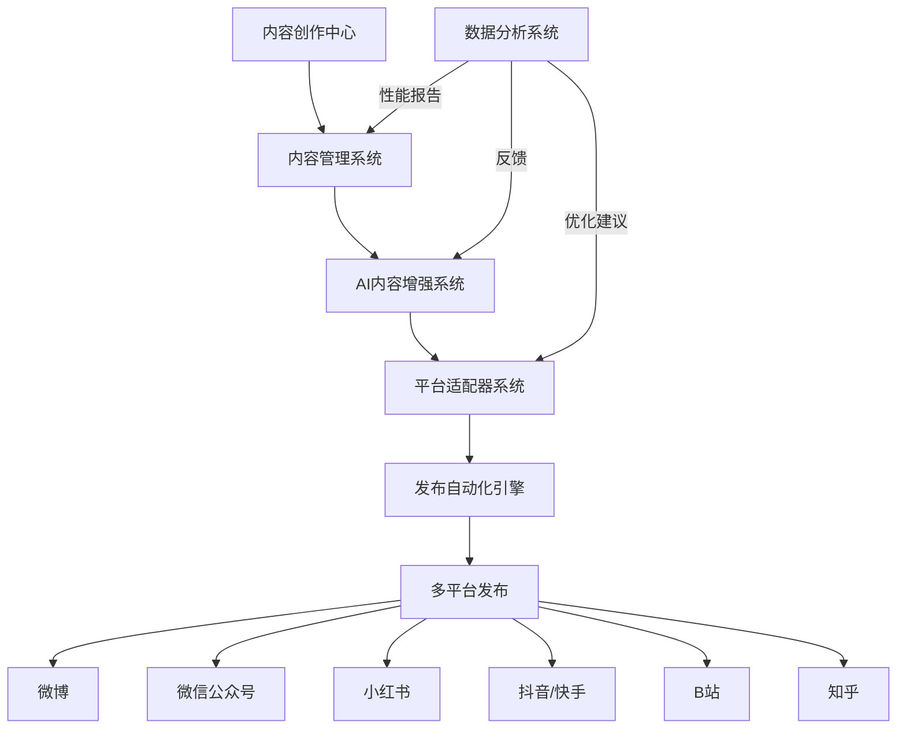

# 📱 自媒体内容管理发布系统设计方案

> **设计时间**: 2026-07-13  
> **设计者**: Hermes Agent  
> **状态**: 设计完成，待实施  
> **需求触发**: 用户需求讨论

---

## 🎯 核心理念：一个中心，多平台发布

一个统一的内容管理系统，能够创作、优化、管理和自动发布内容到多个社交媒体平台，实现高效的自媒体运营。

### 🔥 核心价值
- **统一管理**: 一个系统管理所有社交媒体账号
- **智能优化**: AI驱动的内容优化和发布时间推荐
- **自动化发布**: 一键发布到多个平台
- **数据驱动**: 基于性能数据持续优化内容策略
- **团队协作**: 支持多人协作的内容创作流程

---

## 📋 系统架构设计



### 系统组件

| 组件 | 功能 | 技术实现 |
|------|------|----------|
| **内容创作中心** | 支持多种内容类型创作 | Python + Hermes LLM |
| **内容管理系统** | 内容存储、版本控制、协作管理 | FastAPI + PostgreSQL |
| **AI内容增强系统** | 智能内容优化、媒体生成 | Hermes LLM + 图像/视频模型 |
| **平台适配器系统** | 多平台内容适配 | 适配器模式 + API客户端 |
| **发布自动化引擎** | 智能发布时间、任务调度 | Celery + Redis |
| **数据分析系统** | 性能追踪、趋势分析、ROI计算 | Pandas + 机器学习 |
| **用户界面** | Web界面、移动端、浏览器插件 | React.js / React Native |

---

## 🛠️ 详细功能设计

### 1. 内容创作中心

#### 支持的内容类型

| 内容类型 | 适合平台 | 格式要求 | AI增强 |
|---------|----------|----------|--------|
| 📝 **长文文章** | 微博、公众号、知乎 | 纯文本/富文本 | ✅ 标题优化、内容增强 |
| 📸 **图文内容** | 小红书、公众号、微博 | 9:16比例 | ✅ 封面生成、文案优化 |
| 🎥 **短视频** | 抖音、快手、B站 | 竖屏3-15秒 | ✅ 字幕生成、封面设计 |
| 🎵 **音频内容** | 播客、音频平台 | MP3格式 | ✅ 文案转语音 |
| 📊 **数据可视化** | B站、知乎、公众号 | 图表、信息图 | ✅ 数据图表生成 |
| 🎮 **互动内容** | 小红书、抖音 | 问答、投票 | ✅ 互动文案生成 |
| 📋 **列表内容** | 知乎、公众号 | 条目化 | ✅ 结构优化 |
| 📈 **新闻资讯** | 微博、公众号 | 标题+摘要 | ✅ 标题优化、摘要生成 |

#### 内容创作工作流

```python
class ContentCreationCenter:
    def __init__(self):
        self.content_templates = self._load_templates()
        self.media_library = MediaLibrary()
        self.llm = HermesLLM()
    
    def create_content(self, content_type, topic, draft=False):
        """创建内容"""
        template = self.content_templates[content_type]
        
        # 基础内容创建
        content = {
            'title': f"{topic} - {datetime.now().strftime('%Y-%m-%d')}",
            'content_type': content_type,
            'topic': topic,
            'status': 'draft' if draft else 'created',
            'author': 'user',
            'created_at': datetime.now(),
            'tags': [],
            'categories': [],
            'platforms': []
        }
        
        # AI辅助创作
        if not draft:
            content = self._ai_assisted_creation(content)
        
        return content
    
    def _ai_assisted_creation(self, content):
        """AI辅助内容创作"""
        # 标题优化
        content['title'] = self._optimize_title(content['title'])
        
        # 内容生成
        content['content'] = self._generate_content(
            content['content_type'], 
            content['topic']
        )
        
        # 媒体素材推荐
        content['media_suggestions'] = self._recommend_media(content)
        
        return content
    
    def _optimize_title(self, title):
        """AI优化标题"""
        prompt = f"""
        请为以下内容生成一个吸引人的标题。
        内容主题：{title}
        
        要求：
        1. 吸引用户点击
        2. 包含关键词以提高搜索排名
        3. 长度适中（微博≤30字，公众号≤64字）
        4. 使用吸引人的表述方式
        
        生成标题：
        """
        return self.llm.generate(prompt)
    
    def _generate_content(self, content_type, topic):
        """AI生成内容"""
        prompt = f"""
        请生成一个{content_type}的内容，主题是：{topic}
        
        要求：
        1. 结构清晰，逻辑严谨
        2. 语言生动，吸引读者
        3. 包含实用信息和价值
        4. 适合在社交媒体发布
        
        内容：
        """
        return self.llm.generate(prompt)
    
    def _recommend_media(self, content):
        """推荐媒体素材"""
        # 根据内容类型推荐合适的媒体格式
        # 生成封面图片
        # 创建信息图
        # 生成表情包
        return []
```

---

### 2. 内容管理系统

#### 数据库设计

```sql
-- 内容表
CREATE TABLE contents (
    id SERIAL PRIMARY KEY,
    title TEXT NOT NULL,
    slug VARCHAR(255) UNIQUE NOT NULL,
    content_type VARCHAR(32) NOT NULL,  -- article, image_text, video, audio, etc.
    status VARCHAR(32) NOT NULL,       -- draft, scheduled, published, archived, deleted
    author_id VARCHAR(64) NOT NULL,
    created_at TIMESTAMP NOT NULL,
    updated_at TIMESTAMP,
    published_at TIMESTAMP,
    version INTEGER DEFAULT 1,
    content_text TEXT,
    content_media JSONB,
    seo_data JSONB,
    tags TEXT[],
    categories TEXT[],
    meta_title TEXT,
    meta_description TEXT,
    featured_image TEXT,
    is_featured BOOLEAN DEFAULT false,
    reading_time INTEGER,
    word_count INTEGER
);

-- 发布记录表
CREATE TABLE publication_records (
    id SERIAL PRIMARY KEY,
    content_id INTEGER NOT NULL REFERENCES contents(id),
    platform VARCHAR(64) NOT NULL,     -- weibo, wechat, xiaohongshu, douyin, etc.
    publish_status VARCHAR(32) NOT NULL,  -- scheduled, published, failed, archived
    publish_time TIMESTAMP,
    url TEXT,
    post_id TEXT,                      -- 平台的唯一ID
    likes INTEGER DEFAULT 0,
    shares INTEGER DEFAULT 0,
    comments INTEGER DEFAULT 0,
    views INTEGER DEFAULT 0,
    saves INTEGER DEFAULT 0,
    clicks INTEGER DEFAULT 0,
    engagement_rate DECIMAL(5,2),
    revenue DECIMAL(10,2),
    cost DECIMAL(10,2),
    roi DECIMAL(10,2),
    created_at TIMESTAMP DEFAULT NOW()
);

-- 平台配置表
CREATE TABLE platform_configs (
    id SERIAL PRIMARY KEY,
    platform VARCHAR(64) UNIQUE NOT NULL,
    api_credentials JSONB NOT NULL,
    posting_rules JSONB NOT NULL,
    optimization_templates JSONB,
    enabled BOOLEAN DEFAULT true,
    created_at TIMESTAMP DEFAULT NOW(),
    updated_at TIMESTAMP
);

-- 工作流表
CREATE TABLE workflows (
    id SERIAL PRIMARY KEY,
    name VARCHAR(255) NOT NULL,
    description TEXT,
    steps JSONB NOT NULL,              -- [step1, step2, step3]
    triggers JSONB,
    schedule VARCHAR(64),
    is_active BOOLEAN DEFAULT true,
    created_by VARCHAR(64) NOT NULL,
    created_at TIMESTAMP DEFAULT NOW()
);

-- 任务表
CREATE TABLE tasks (
    id SERIAL PRIMARY KEY,
    workflow_id INTEGER REFERENCES workflows(id),
    content_id INTEGER REFERENCES contents(id),
    assigned_to VARCHAR(64),
    step VARCHAR(255) NOT NULL,
    status VARCHAR(32) DEFAULT 'pending',  -- pending, in_progress, completed, failed
    priority INTEGER DEFAULT 3,            -- 1-5, 1=最高
    due_date TIMESTAMP,
    completed_at TIMESTAMP,
    notes TEXT,
    created_at TIMESTAMP DEFAULT NOW()
);

-- 内容版本表
CREATE TABLE content_versions (
    id SERIAL PRIMARY KEY,
    content_id INTEGER NOT NULL REFERENCES contents(id),
    version INTEGER NOT NULL,
    title TEXT,
    content_text TEXT,
    content_media JSONB,
    seo_data JSONB,
    changed_by VARCHAR(64),
    change_reason TEXT,
    created_at TIMESTAMP DEFAULT NOW()
);
```

#### 核心功能

```python
class ContentManagementSystem:
    def __init__(self):
        self.content_repository = ContentRepository()
        self.version_control = VersionControl()
        self.collaboration = CollaborationSystem()
        self.analytics = ContentAnalytics()
    
    def store_content(self, content_data):
        """存储和管理内容"""
        # 验证内容
        validated = self._validate_content(content_data)
        
        # 保存内容
        content_id = self.content_repository.save(validated)
        
        # 记录版本
        self.version_control.create_version(content_id, validated)
        
        # 索引内容（便于搜索）
        self._index_content(content_id)
        
        return content_id
    
    def _validate_content(self, content):
        """验证内容格式和规则"""
        # 检查必填字段
        # 验证内容长度
        # 检查标签和分类
        # 验证媒体文件
        return content
    
    def _index_content(self, content_id):
        """索引内容便于搜索"""
        content = self.content_repository.get(content_id)
        # 创建搜索索引
        # 添加到全文搜索引擎
        pass
    
    def get_content(self, content_id):
        """获取内容详情"""
        content = self.content_repository.get(content_id)
        content['versions'] = self.version_control.get_versions(content_id)
        content['tasks'] = self.collaboration.get_tasks(content_id)
        content['analytics'] = self.analytics.get_basic_stats(content_id)
        return content
    
    def search_contents(self, query, filters=None):
        """搜索内容"""
        # 全文搜索
        # 过滤器应用
        # 分页处理
        return []
    
    def update_content(self, content_id, updates):
        """更新内容"""
        old_content = self.content_repository.get(content_id)
        updated = {**old_content, **updates}
        
        # 保存新版本
        self.version_control.create_version(content_id, updated)
        
        # 更新主内容
        self.content_repository.update(content_id, updated)
        
        return updated
```

---

### 3. AI内容增强系统

#### 智能内容优化

```python
class AIContentEnhancer:
    def __init__(self):
        self.llm = HermesLLM()
        self.style_transfer = StyleTransferModel()
        self.image_generator = ImageGenerationModel()
        self.video_editor = VideoEditingModel()
        self.translator = TranslationModel()
    
    def optimize_content(self, content, target_platform=None):
        """AI驱动的内容优化"""
        optimized = {
            'title': content.get('title', ''),
            'content': content.get('content', ''),
            'media': content.get('media_suggestions', []),
            'seo': {}
        }
        
        # 标题优化
        if target_platform:
            optimized['title'] = self._optimize_title_for_platform(
                optimized['title'], 
                target_platform
            )
        
        # 内容增强
        optimized['content'] = self._enhance_content(
            optimized['content'],
            target_platform
        )
        
        # 媒体素材生成
        optimized['media'] = self._generate_media_assets(
            content,
            target_platform
        )
        
        # SEO优化
        optimized['seo'] = self._apply_seo_optimization(
            optimized['title'],
            optimized['content'],
            target_platform
        )
        
        return optimized
    
    def _optimize_title_for_platform(self, title, platform):
        """为特定平台优化标题"""
        platform_rules = self._get_platform_rules(platform)
        
        prompt = f"""
        请为以下内容生成适合在{platform}发布的吸引人的标题。
        内容主题：{title}
        
        平台规则：
        - 最大长度：{platform_rules['max_title_length']}
        - 推荐格式：{platform_rules['title_format']}
        - 关键词要求：{platform_rules['keywords']}
        
        要求：
        1. 符合{platform}的用户习惯
        2. 包含关键词以提高搜索排名
        3. 使用吸引人的表述方式
        4. 长度适合{platform}的标题要求
        
        生成标题：
        """
        return self.llm.generate(prompt)
    
    def _enhance_content(self, content, platform):
        """增强内容质量"""
        prompt = f"""
        请优化以下内容，使其更适合在{platform}发布。
        
        原始内容：{content[:500]}...
        
        要求：
        1. 结构清晰，段落分明
        2. 语言生动，吸引读者
        3. 包含实用信息和价值
        4. 适合社交媒体传播
        5. 添加适当的情感表达
        
        优化后的内容：
        """
        return self.llm.generate(prompt)
    
    def _generate_media_assets(self, content, platform):
        """生成媒体素材"""
        assets = []
        
        # 生成封面图片
        if not content.get('featured_image'):
            cover_prompt = f"""
            为以下内容生成一个吸引人的封面图片：
            标题：{content.get('title', '')}
            内容摘要：{content.get('content', '')[:200]}...
            
            要求：
            - 适合{platform}的尺寸要求
            - 视觉吸引力强
            - 传达内容主题
            """
            cover_image = self.image_generator.generate(cover_prompt)
            assets.append({
                'type': 'cover_image',
                'url': cover_image,
                'platform': platform
            })
        
        # 生成信息图
        if content.get('content_type') == 'data_visualization':
            chart_data = self._extract_chart_data(content['content'])
            chart_image = self._generate_chart_image(chart_data)
            assets.append({
                'type': 'infographic',
                'url': chart_image,
                'platform': platform
            })
        
        return assets
    
    def _apply_seo_optimization(self, title, content, platform):
        """应用SEO优化"""
        seo_data = {
            'title': title,
            'description': self._generate_meta_description(content),
            'keywords': self._extract_keywords(content),
            'alt_text': self._generate_alt_text(content)
        }
        
        # 针对特定平台优化
        if platform == 'wechat':
            seo_data['recommended_format'] = '图文消息'
        elif platform == 'xiaohongshu':
            seo_data['recommended_format'] = '笔记'
        
        return seo_data
```

---

### 4. 平台适配器系统

#### 适配器架构

```python
class PlatformAdapter:
    def __init__(self):
        self.platforms = {
            'weibo': WeiboAdapter(),
            'wechat': WeChatAdapter(),
            'xiaohongshu': XiaohongshuAdapter(),
            'douyin': DouyinAdapter(),
            'kuaishou': KuaishouAdapter(),
            'bilibili': BilibiliAdapter(),
            'zhihu': ZhihuAdapter(),
            'custom': CustomPlatformAdapter()
        }
    
    def adapt_content(self, content, target_platform):
        """将内容适配到目标平台"""
        if target_platform not in self.platforms:
            raise ValueError(f"Unsupported platform: {target_platform}")
        
        adapter = self.platforms[target_platform]
        return adapter.adapt(content)
    
    def get_platform_rules(self, platform):
        """获取平台发布规则"""
        if platform not in self.platforms:
            return None
        return self.platforms[platform].get_rules()
    
    def validate_content_for_platform(self, content, platform):
        """验证内容是否符合平台规则"""
        adapter = self.platforms.get(platform)
        if adapter:
            return adapter.validate(content)
        return False
```

#### 各平台适配器示例

```python
class WeiboAdapter:
    def adapt(self, content):
        """微博内容适配"""
        adapted = {
            'text': self._format_weibo_text(content.get('content', '')),
            'images': self._format_images(content.get('media', []), 'weibo'),
            'video': self._format_video(content.get('media', []), 'weibo'),
            'location': content.get('location'),
            'visible': content.get('visible', 'public')
        }
        return adapted
    
    def get_rules(self):
        """微博发布规则"""
        return {
            'max_text_length': 140,
            'max_images': 9,
            'video_duration_limit': 140,
            'hashtag_format': '#标签#',
            'mention_format': '@用户名',
            'best_posting_time': ['12:00-14:00', '18:00-22:00'],
            'recommended_format': '纯文本或图文'
        }
    
    def validate(self, content):
        """验证微博内容"""
        text = content.get('text', '')
        images = content.get('images', [])
        video = content.get('video')
        
        # 检查文本长度
        if len(text) > 140:
            return False, '文本超过140字'
        
        # 检查图片数量
        if len(images) > 9:
            return False, '图片超过9张'
        
        # 检查视频时长
        if video and video.get('duration', 0) > 140:
            return False, '视频超过140秒'
        
        return True, '验证通过'

class WeChatAdapter:
    def adapt(self, content):
        """微信公众号内容适配"""
        adapted = {
            'title': self._format_title(content.get('title', '')),
            'author': content.get('author', '作者'),
            'content': self._format_rich_text(content.get('content', '')),
            'cover_image': self._format_cover(content.get('media', []), 'wechat'),
            'images': self._format_images(content.get('media', []), 'wechat'),
            'show_cover_pic': True,
            'need_open_comment': content.get('allow_comments', True)
        }
        return adapted
    
    def get_rules(self):
        """微信公众号规则"""
        return {
            'max_title_length': 64,
            'max_intro_length': 120,
            'cover_image_size': '236x236',
            'recommended_format': '图文消息',
            'max_article_length': 100000,
            'best_posting_time': ['08:00-10:00', '14:00-16:00']
        }

class XiaohongshuAdapter:
    def adapt(self, content):
        """小红书内容适配"""
        adapted = {
            'title': self._format_xhs_title(content.get('title', '')),
            'description': self._format_description(content.get('content', '')[:150]),
            'images': self._format_xhs_images(content.get('media', []), 'xiaohongshu'),
            'video': self._format_xhs_video(content.get('media', []), 'xiaohongshu'),
            'tags': self._format_tags(content.get('tags', [])),
            'location': content.get('location'),
            'discovery_allowed': True
        }
        return adapted
    
    def get_rules(self):
        """小红书规则"""
        return {
            'max_title_length': 30,
            'max_description_length': 150,
            'max_images': 9,
            'video_duration': '3-15秒',
            'recommended_ratio': '9:16 (竖屏)',
            'hashtag_format': '#标签',
            'best_posting_time': ['09:00-11:00', '19:00-22:00']
        }
```

---

### 5. 发布自动化引擎

#### 发布流程管理

```python
class PublicationEngine:
    def __init__(self):
        self.task_queue = []
        self.scheduler = TaskScheduler()
        self.monitor = PublicationMonitor()
        self.retry_policy = RetryPolicy()
        self.api_clients = APIClientManager()
    
    def schedule_publication(self, content_id, platforms, schedule_time=None):
        """安排内容发布"""
        task = {
            'content_id': content_id,
            'platforms': platforms,
            'schedule_time': schedule_time or datetime.now(),
            'status': 'scheduled',
            'retries': 0,
            'created_at': datetime.now()
        }
        
        self.task_queue.append(task)
        self.scheduler.add_task(task)
        
        return task
    
    def execute_publication(self, task):
        """执行发布任务"""
        try:
            content = self._get_content(task['content_id'])
            
            for platform in task['platforms']:
                # 适配内容
                adapted_content = self._adapt_content(content, platform)
                
                # 验证内容
                is_valid, message = self._validate_content(adapted_content, platform)
                if not is_valid:
                    raise ValueError(f"内容验证失败: {message}")
                
                # 获取API客户端
                api_client = self.api_clients.get_client(platform)
                
                # 发布内容
                result = api_client.publish(adapted_content)
                
                # 记录发布结果
                self._record_publication(task, platform, result)
            
            task['status'] = 'completed'
            task['completed_at'] = datetime.now()
            
        except Exception as e:
            task['status'] = 'failed'
            task['error'] = str(e)
            task['retries'] += 1
            
            # 根据重试策略决定是否重试
            if self.retry_policy.should_retry(task):
                task['status'] = 'retrying'
                self.scheduler.reschedule_task(task)
            else:
                self._handle_failure(task)
    
    def _adapt_content(self, content, platform):
        """适配内容到目标平台"""
        adapter = PlatformAdapter()
        return adapter.adapt_content(content, platform)
    
    def _validate_content(self, content, platform):
        """验证内容是否符合平台规则"""
        adapter = PlatformAdapter()
        return adapter.validate_content_for_platform(content, platform)
    
    def _record_publication(self, task, platform, result):
        """记录发布结果"""
        record = {
            'task_id': task['id'],
            'content_id': task['content_id'],
            'platform': platform,
            'publish_status': 'published',
            'publish_time': result.get('publish_time', datetime.now()),
            'url': result.get('url'),
            'post_id': result.get('post_id'),
            'metadata': result.get('metadata', {}),
            'created_at': datetime.now()
        }
        
        # 保存到数据库
        self._save_publication_record(record)
        
        return record
    
    def _save_publication_record(self, record):
        """保存发布记录到数据库"""
        # 实现数据库保存逻辑
        pass
    
    def get_publication_status(self, task_id):
        """获取发布任务状态"""
        task = next((t for t in self.task_queue if t['id'] == task_id), None)
        if task:
            return {
                'status': task['status'],
                'progress': self._calculate_progress(task),
                'logs': self.monitor.get_task_logs(task_id)
            }
        return None
    
    def _calculate_progress(self, task):
        """计算任务进度"""
        completed_platforms = sum(1 for p in task.get('platforms', []) if self._is_platform_published(task['id'], p))
        total_platforms = len(task.get('platforms', []))
        return int((completed_platforms / total_platforms) * 100) if total_platforms > 0 else 0
```

#### API客户端管理

```python
class APIClientManager:
    def __init__(self):
        self.clients = {}
        self.configs = self._load_platform_configs()
    
    def _load_platform_configs(self):
        """加载平台配置"""
        # 从数据库或配置文件加载
        return {}
    
    def get_client(self, platform):
        """获取平台API客户端"""
        if platform not in self.clients:
            config = self.configs.get(platform)
            if not config:
                raise ValueError(f"No configuration found for platform: {platform}")
            
            client_class = self._get_client_class(platform)
            self.clients[platform] = client_class(config)
        
        return self.clients[platform]
    
    def _get_client_class(self, platform):
        """根据平台返回对应的客户端类"""
        client_classes = {
            'weibo': WeiboAPIClient,
            'wechat': WeChatAPIClient,
            'xiaohongshu': XiaohongshuAPIClient,
            'douyin': DouyinAPIClient,
            'kuaishou': KuaishouAPIClient,
            'bilibili': BilibiliAPIClient,
            'zhihu': ZhihuAPIClient
        }
        return client_classes.get(platform)
    
    def add_platform_config(self, platform, config):
        """添加平台配置"""
        self.configs[platform] = config
        self.clients.pop(platform, None)  # 清除缓存的客户端
```

---

### 6. 数据分析和优化系统

#### 性能监控和分析

```python
class ContentAnalytics:
    def __init__(self):
        self.metrics = {
            'impressions': 0,
            'engagement': 0,
            'conversions': 0,
            'reach': 0,
            'shares': 0,
            'comments': 0,
            'likes': 0,
            'saves': 0,
            'clicks': 0,
            'roi': 0
        }
        self.trends = {}
        self.audience = {}
    
    def track_performance(self, content_id):
        """跟踪内容性能"""
        # 从各平台API获取数据
        platform_data = self._fetch_platform_data(content_id)
        
        # 计算关键指标
        metrics = self._calculate_metrics(platform_data)
        
        # 更新数据库
        self._save_metrics(content_id, metrics)
        
        # 生成分析报告
        insights = self._generate_insights(content_id, metrics)
        
        return {
            'metrics': metrics,
            'insights': insights
        }
    
    def _fetch_platform_data(self, content_id):
        """从各平台获取数据"""
        # 查询数据库中的发布记录
        # 调用平台API获取最新数据
        # 合并数据
        return {}
    
    def _calculate_metrics(self, platform_data):
        """计算关键指标"""
        total_impressions = sum(p.get('views', 0) for p in platform_data.values())
        total_engagement = sum(
            p.get('likes', 0) + p.get('shares', 0) + p.get('comments', 0)
            for p in platform_data.values()
        )
        total_reach = len(set(p.get('url') for p in platform_data.values()))
        
        # ROI计算（如果有收入数据）
        total_revenue = sum(p.get('revenue', 0) for p in platform_data.values())
        total_cost = sum(p.get('cost', 0) for p in platform_data.values())
        roi = (total_revenue - total_cost) / total_cost * 100 if total_cost > 0 else 0
        
        return {
            'impressions': total_impressions,
            'engagement': total_engagement,
            'reach': total_reach,
            'ctr': (total_engagement / total_impressions * 100) if total_impressions > 0 else 0,
            'engagement_rate': (total_engagement / total_impressions * 100) if total_impressions > 0 else 0,
            'revenue': total_revenue,
            'cost': total_cost,
            'roi': roi,
            'best_platform': self._find_best_platform(platform_data),
            'worst_platform': self._find_worst_platform(platform_data)
        }
    
    def _generate_insights(self, content_id, metrics):
        """生成内容洞察"""
        insights = []
        
        # 识别最佳发布时间
        best_time = self._recommend_best_posting_time(content_id)
        if best_time:
            insights.append({
                'type': 'posting_time',
                'message': f"建议在{best_time['time']}发布，预计能获得{best_time['expected_engagement']}%更高的互动",
                'confidence': best_time['confidence']
            })
        
        # 推荐内容类型
        recommended_type = self._recommend_content_type(content_id)
        if recommended_type:
            insights.append({
                'type': 'content_type',
                'message': f"建议尝试{recommended_type['type']}内容格式，预计表现更好",
                'confidence': recommended_type['confidence']
            })
        
        # 平台表现分析
        platform_analysis = self._analyze_platform_performance(content_id)
        insights.extend(platform_analysis)
        
        return insights
    
    def _recommend_best_posting_time(self, content_id):
        """推荐最佳发布时间"""
        # 基于历史数据分析
        # 考虑平台特性
        # 考虑用户在线时间
        return None
    
    def _analyze_platform_performance(self, content_id):
        """分析各平台表现"""
        analysis = []
        
        # 获取各平台的表现数据
        platform_data = self._fetch_platform_data(content_id)
        
        for platform, data in platform_data.items():
            engagement_rate = data.get('engagement_rate', 0)
            if engagement_rate > 5:
                analysis.append({
                    'type': 'platform_performance',
                    'platform': platform,
                    'message': f"在{platform}表现优秀，互动率{engagement_rate}%",
                    'confidence': 0.9
                })
            elif engagement_rate < 1:
                analysis.append({
                    'type': 'platform_performance',
                    'platform': platform,
                    'message': f"在{platform}表现不佳，建议优化内容或调整策略",
                    'confidence': 0.8
                })
        
        return analysis
    
    def generate_weekly_report(self, user_id):
        """生成周报"""
        report = {
            'period': 'weekly',
            'generated_at': datetime.now(),
            'summary': {},
            'top_performers': [],
            'insights': [],
            'recommendations': []
        }
        
        # 汇总数据
        report['summary'] = self._generate_summary(user_id)
        
        # 找出表现最好的内容
        report['top_performers'] = self._get_top_performers(user_id)
        
        # 生成洞察
        report['insights'] = self._generate_weekly_insights(user_id)
        
        # 生成建议
        report['recommendations'] = self._generate_recommendations(user_id)
        
        return report
```

#### 智能优化建议

```python
class OptimizationAdvisor:
    def __init__(self):
        self.llm = HermesLLM()
        self.analytics = ContentAnalytics()
    
    def get_optimization_suggestions(self, content_id):
        """获取内容优化建议"""
        performance = self.analytics.track_performance(content_id)
        
        prompt = f"""
        基于以下内容的表现数据，请提供具体的优化建议：
        
        内容表现：
        - 曝光量：{performance['metrics']['impressions']}
        - 互动数：{performance['metrics']['engagement']}
        - 互动率：{performance['metrics']['engagement_rate']}%
        - 点击率：{performance['metrics']['ctr']}%
        - 转化率：{performance.get('conversion_rate', 0)}%
        - 收入：￥{performance['metrics']['revenue']}
        - ROI：{performance['metrics']['roi']}%
        - 最佳平台：{performance['metrics']['best_platform']}
        - 最差平台：{performance['metrics']['worst_platform']}
        
        用户反馈：{performance.get('user_feedback', '无')}
        
        请提供：
        1. 具体的标题优化建议
        2. 内容结构调整建议
        3. 媒体素材改进建议
        4. 发布时间优化建议
        5. 平台策略建议
        6. 标签和分类优化建议
        
        要求：
        - 建议要具体可执行
        - 基于数据分析
        - 考虑平台特性
        - 提供预期改进效果
        
        建议：
        """
        
        suggestions = self.llm.generate(prompt)
        return self._parse_suggestions(suggestions)
    
    def _parse_suggestions(self, suggestions_text):
        """解析AI生成的建议"""
        # 解析建议文本，提取结构化数据
        return []
    
    def get_content_strategy(self, category):
        """获取内容策略建议"""
        prompt = f"""
        请为以下内容类别提供一个完整的内容策略建议：
        
        内容类别：{category}
        
        要求：
        1. 内容创作方向
        2. 发布频率建议
        3. 平台选择策略
        4. 标题和文案风格
        5. 媒体素材要求
        6. SEO优化要点
        7. 互动和转化策略
        8. 成功案例参考
        
        内容策略：
        """
        
        return self.llm.generate(prompt)
```

---

## 🚀 技术实现方案

### 后端技术栈

```
自媒体管理系统 (Python 3.11+)
├── Web框架: FastAPI (推荐) / Flask
├── 任务调度: Celery + Redis
├── 数据库: PostgreSQL 15+ (推荐) / SQLite (开发)
├── 搜索引擎: Elasticsearch / PostgreSQL全文搜索
├── 缓存: Redis
├── API客户端: requests / httpx / 官方SDK
├── AI模型: Hermes LLM + 自定义模型
├── 图像处理: PIL / OpenCV / Stable Diffusion API
├── 视频处理: FFmpeg / MoviePy
├── 部署: Docker + Nginx + Gunicorn
├── 监控: Prometheus + Grafana
└── 日志: ELK Stack (Elasticsearch + Logstash + Kibana)
```

### 前端技术栈

```
Web界面 (React.js 18+)
├── UI框架: Ant Design / Material-UI / Chakra UI
├── 状态管理: Redux Toolkit / Zustand
├── 表单处理: React Hook Form
├── 数据可视化: D3.js / Chart.js / ECharts
├── 富文本编辑器: Draft.js / Slate.js / TipTap
├── 文件上传: react-dropzone / Uppy
└── 国际化: react-i18next

移动端APP (React Native 0.70+)
├── 组件库: React Native Paper / NativeBase
├── 导航: React Navigation
├── 状态管理: Redux / MobX
├── 离线支持: WatermelonDB / Realm
└── 推送通知: Firebase Cloud Messaging / 极光推送

浏览器插件 (Chrome Extension)
├── Manifest V3
├── 内容脚本: 网页内容提取
├── 后台脚本: 任务调度
├── 弹出式界面: 用户操作界面
└── 存储: Chrome Storage API
```

### 第三方服务

```
云服务商: 阿里云 / 腾讯云 / AWS / 华为云
├── 云服务器: ECS / EC2
├── 对象存储: OSS / S3
├── 数据库服务: RDS / Aurora
├── CDN加速: CDN
├── 消息队列: RabbitMQ / SQS
└── 监控告警: Cloud Monitor / CloudWatch

社交媒体平台API
├── 微博开放平台: https://open.weibo.com/
├── 微信公众平台: https://mp.weixin.qq.com/
├── 小红书开放平台: https://open.xiaohongshu.com/
├── 抖音开放平台: https://open.douyin.com/
├── 快手开放平台: https://open.kuaishou.com/
├── B站开放平台: https://open.bilibili.com/
└── 知乎开放平台: https://www.zhihu.com/api/v4/

AI服务
├── 文本生成: Hermes LLM
├── 图像生成: Stable Diffusion / DALL-E / Midjourney API
├── 视频编辑: Runway ML / Pika Labs
├── 语音合成: 科大讯飞 / 百度语音
└── 翻译服务: 谷歌翻译 / 有道翻译
```

### 部署架构

```
生产环境部署
┌───────────────────────────────────────────────────────┐
│                   负载均衡器 (Nginx)                  │
└───────────────────┬───────────────────────────────────┘
                    │
┌───────────────────▼───────────────────┐ ┌─────────────▼─────────────┐
│       应用服务器 1 (FastAPI)          │ │   应用服务器 2 (FastAPI)  │
└───────────────────┬───────────────────┘ └─────────────┬─────────────┘
                    │                                   │
┌───────────────────▼───────────────────┐ ┌─────────────▼─────────────┐
│       任务队列 (Celery Worker)         │ │   定时任务 (Celery Beat)  │
└───────────────────┬───────────────────┘ └─────────────┬─────────────┘
                    │                                   │
┌───────────────────▼───────────────────┐ ┌─────────────▼─────────────┐
│           Redis (缓存+队列)            │ │   PostgreSQL (主数据库)   │
└───────────────────┬───────────────────┘ └─────────────┬─────────────┘
                    │                                   │
┌───────────────────▼───────────────────┐ ┌─────────────▼─────────────┐
│       Elasticsearch (搜索)            │ │   对象存储 (OSS/S3)       │
└───────────────────────────────────────┘ └───────────────────────────┘

开发环境部署
┌───────────────────────────────────────────────────────┐
│                   Docker Compose                    │
├───────────────────┬───────────────────┬───────────────┤
│   FastAPI (Web)   │  Celery Worker    │  PostgreSQL   │
├───────────────────┼───────────────────┼───────────────┤
│   Redis (缓存)    │  Elasticsearch    │   Nginx       │
└───────────────────┴───────────────────┴───────────────┘
```

---

## 📊 实施路线图

### 阶段1：基础功能开发（3-4周）

#### 第1-2周：核心系统开发
- [ ] **项目初始化** - 创建项目结构，配置开发环境
- [ ] **数据库设计** - 完整的数据库表结构设计和实现
- [ ] **内容管理系统** - 基础的内容创建、存储、检索功能
- [ ] **用户认证系统** - 用户注册、登录、权限管理
- [ ] **平台适配器基础** - 微博、微信公众号适配器

#### 第3周：发布自动化
- [ ] **发布引擎** - 任务调度、发布执行、状态跟踪
- [ ] **API客户端管理** - 平台API客户端封装
- [ ] **发布验证** - 内容验证、平台规则检查
- [ ] **发布记录** - 发布历史、性能数据收集

#### 第4周：Web界面开发
- [ ] **管理后台** - React.js基础界面
- [ ] **内容编辑器** - 富文本编辑器集成
- [ ] **发布管理面板** - 发布任务查看和管理
- [ ] **数据展示** - 基础的数据图表

### 阶段2：AI增强功能（2-3周）

#### 第5-6周：智能内容优化
- [ ] **AI内容生成** - 使用Hermes LLM生成内容
- [ ] **标题优化** - AI驱动的标题生成和优化
- [ ] **内容增强** - 语言优化、结构优化
- [ ] **SEO优化** - 元数据自动生成

#### 第7周：智能发布优化
- [ ] **最佳发布时间推荐** - 基于数据分析
- [ ] **内容策略建议** - AI生成内容策略
- [ ] **A/B测试功能** - 测试不同内容版本
- [ ] **性能预测** - 预测内容表现

### 阶段3：多平台扩展（3-4周）

#### 第8-9周：小红书、抖音、快手
- [ ] **小红书适配器** - 支持小红书发布
- [ ] **抖音适配器** - 支持短视频发布
- [ ] **快手适配器** - 支持快手发布
- [ ] **视频内容优化** - 视频字幕、封面生成

#### 第10-11周：B站、知乎、其他平台
- [ ] **B站适配器** - 支持B站发布
- [ ] **知乎适配器** - 支持知乎发布
- [ ] **自定义平台** - 支持任意平台配置
- [ ] **批量发布功能** - 批量处理多个内容

### 阶段4：高级功能（持续）

#### 第12周：团队协作
- [ ] **团队账号管理** - 多用户协作
- [ ] **权限管理** - 细粒度权限控制
- [ ] **任务分配** - 任务流程管理
- [ ] **审批流程** - 内容审核流程

#### 第13周：数据分析和报告
- [ ] **性能追踪** - 详细的内容表现数据
- [ ] **趋势分析** - 内容趋势识别
- [ ] **ROI计算** - 投资回报率分析
- [ ] **周报/月报** - 自动生成报告

#### 第14周：移动端和插件
- [ ] **移动端APP** - React Native开发
- [ ] **浏览器插件** - 快速保存和发布
- [ ] **桌面应用** - Electron桌面应用
- [ ] **API接口** - 开放API供其他系统集成

---

## 💡 创意增强功能

### 1. 智能内容日历

```python
class ContentCalendar:
    def __init__(self):
        self.events = self._load_holidays()
        self.trends = self._load_content_trends()
        self.user_events = {}
    
    def generate_calendar(self, time_range='month'):
        """生成内容日历"""
        calendar = []
        
        # 添加重要节日
        calendar.extend(self._get_holidays(time_range))
        
        # 添加内容趋势
        calendar.extend(self._get_trend_suggestions(time_range))
        
        # 添加用户自定义事件
        calendar.extend(self._get_user_events(time_range))
        
        # 添加最佳发布时间建议
        calendar.extend(self._get_best_posting_times(time_range))
        
        return sorted(calendar, key=lambda x: x['date'])
    
    def _get_holidays(self, time_range):
        """获取节假日"""
        holidays = [
            {'date': '2026-01-01', 'type': 'festival', 'name': '元旦', 'priority': 1},
            {'date': '2026-02-14', 'type': 'festival', 'name': '情人节', 'priority': 2},
            {'date': '2026-03-08', 'type': 'festival', 'name': '妇女节', 'priority': 2},
            {'date': '2026-05-01', 'type': 'festival', 'name': '劳动节', 'priority': 1},
            {'date': '2026-06-01', 'type': 'festival', 'name': '儿童节', 'priority': 2},
            {'date': '2026-10-01', 'type': 'festival', 'name': '国庆节', 'priority': 1},
            {'date': '2026-12-25', 'type': 'festival', 'name': '圣诞节', 'priority': 2},
            # 添加更多节日...
        ]
        
        # 根据时间范围筛选
        if time_range == 'week':
            return [h for h in holidays if self._is_this_week(h['date'])]
        elif time_range == 'month':
            return [h for h in holidays if self._is_this_month(h['date'])]
        else:
            return holidays
    
    def _get_trend_suggestions(self, time_range):
        """获取内容趋势建议"""
        trends = [
            {
                'date': '2026-07-15',
                'type': 'trend',
                'name': '夏季饮品热销',
                'description': '夏季来临，饮品类内容预计受欢迎',
                'priority': 3
            },
            {
                'date': '2026-08-01',
                'type': 'trend',
                'name': '开学季营销',
                'description': '8月开学季，教育、学习用品类内容需求增加',
                'priority': 2
            },
            # 添加更多趋势...
        ]
        
        return trends
    
    def _get_best_posting_times(self, time_range):
        """获取最佳发布时间建议"""
        best_times = [
            {
                'date': '2026-07-13',
                'time': '12:30',
                'platform': 'weibo',
                'reason': '午休时间，用户活跃度高'
            },
            {
                'date': '2026-07-13',
                'time': '19:00',
                'platform': 'xiaohongshu',
                'reason': '晚上用户刷手机时间高峰'
            },
            # 基于历史数据生成更多建议
        ]
        
        return best_times
```

### 2. 跨平台内容转换

```python
class CrossPlatformConverter:
    def __init__(self):
        self.platform_rules = self._load_platform_rules()
    
    def convert_between_platforms(self, content, source_platform, target_platform):
        """将内容从一个平台转换到另一个平台"""
        
        # 1. 从源平台提取内容
        source_content = self._extract_from_platform(content, source_platform)
        
        # 2. 适配到目标平台
        target_content = self._adapt_to_platform(source_content, target_platform)
        
        # 3. AI优化
        optimized = self._ai_optimize(target_content, target_platform)
        
        return optimized
    
    def _extract_from_platform(self, content, platform):
        """从平台提取内容"""
        adapter = PlatformAdapter()
        rules = adapter.get_platform_rules(platform)
        
        # 解析平台特定格式
        # 提取文本、图片、视频等
        extracted = {
            'text': content.get('text', ''),
            'images': content.get('images', []),
            'video': content.get('video'),
            'title': content.get('title', ''),
            'tags': content.get('tags', [])
        }
        
        return extracted
    
    def _adapt_to_platform(self, content, platform):
        """适配到目标平台"""
        adapter = PlatformAdapter()
        rules = adapter.get_platform_rules(platform)
        
        adapted = {
            'platform': platform,
            'title': self._format_title(content['title'], platform),
            'content': self._format_content(content['text'], platform),
            'media': self._format_media(content['images'], content.get('video'), platform),
            'tags': self._format_tags(content['tags'], platform),
            'metadata': {
                'source_platform': content.get('source_platform', 'unknown')
            }
        }
        
        return adapted
    
    def _ai_optimize(self, content, platform):
        """AI优化内容"""
        enhancer = AIContentEnhancer()
        return enhancer.optimize_content(content, platform)
```

### 3. 团队协作工作流

```python
class TeamCollaborationWorkflow:
    def __init__(self):
        self.roles = {
            'admin': {'permissions': ['create', 'read', 'update', 'delete', 'manage_users']},
            'editor': {'permissions': ['create', 'read', 'update']},
            'contributor': {'permissions': ['create', 'read']},
            'viewer': {'permissions': ['read']}
        }
        self.workflows = {}
    
    def create_workflow(self, workflow_name, steps, roles):
        """创建团队协作工作流"""
        workflow = {
            'id': str(uuid.uuid4()),
            'name': workflow_name,
            'steps': steps,
            'roles': roles,
            'status': 'active',
            'created_at': datetime.now(),
            'created_by': 'admin'
        }
        
        self.workflows[workflow['id']] = workflow
        return workflow
    
    def assign_task(self, content_id, user_id, step, role='contributor'):
        """分配任务"""
        if role not in self.roles:
            raise ValueError(f"Invalid role: {role}")
        
        task = {
            'id': str(uuid.uuid4()),
            'content_id': content_id,
            'user_id': user_id,
            'step': step,
            'role': role,
            'status': 'pending',
            'assigned_at': datetime.now(),
            'due_date': datetime.now() + timedelta(days=7)
        }
        
        # 保存任务
        self._save_task(task)
        
        # 发送通知
        self._send_notification(user_id, f"新任务待处理: {content_id}")
        
        return task
    
    def approve_content(self, task_id, approver_id):
        """审批内容"""
        task = self._get_task(task_id)
        
        if task['status'] != 'in_progress':
            raise ValueError("Task is not in progress")
        
        # 审批逻辑
        approval = {
            'task_id': task_id,
            'approver_id': approver_id,
            'approved': True,
            'comments': '内容质量良好，符合要求',
            'approved_at': datetime.now()
        }
        
        # 更新任务状态
        task['status'] = 'completed'
        task['completed_at'] = datetime.now()
        self._save_task(task)
        
        # 通知下一步
        self._notify_next_step(task)
        
        return approval
    
    def get_workflow_status(self, workflow_id):
        """获取工作流状态"""
        workflow = self.workflows.get(workflow_id)
        if not workflow:
            return None
        
        # 统计任务状态
        tasks = self._get_tasks_by_workflow(workflow_id)
        status = {
            'workflow': workflow['name'],
            'total_tasks': len(tasks),
            'pending_tasks': sum(1 for t in tasks if t['status'] == 'pending'),
            'in_progress_tasks': sum(1 for t in tasks if t['status'] == 'in_progress'),
            'completed_tasks': sum(1 for t in tasks if t['status'] == 'completed'),
            'overdue_tasks': sum(1 for t in tasks if t['status'] == 'pending' and t['due_date'] < datetime.now()),
            'team_members': list(set(t['user_id'] for t in tasks))
        }
        
        return status
```

### 4. 智能发布优化

```python
class SmartPublishingOptimizer:
    def __init__(self):
        self.llm = HermesLLM()
        self.analytics = ContentAnalytics()
        self.calendar = ContentCalendar()
    
    def optimize_publishing_schedule(self, content):
        """优化发布时间"""
        
        # 1. 分析历史数据
        best_times = self._get_best_posting_times(content['category'])
        
        # 2. 考虑平台特性
        platform_rules = {}
        for platform in content['platforms']:
            adapter = PlatformAdapter()
            platform_rules[platform] = adapter.get_platform_rules(platform)
        
        # 3. AI推荐最佳时间
        recommended_time = self._ai_recommend_time(content, best_times, platform_rules)
        
        # 4. 考虑用户在线时间
        personalized_time = self._personalize_time(recommended_time)
        
        # 5. 检查日历事件
        calendar_events = self.calendar.generate_calendar('week')
        
        return {
            'recommended_time': recommended_time,
            'personalized_time': personalized_time,
            'calendar_events': calendar_events,
            'reasoning': self._generate_recommendation_reason(content, recommended_time, calendar_events)
        }
    
    def _get_best_posting_times(self, category):
        """获取最佳发布时间"""
        # 基于历史数据分析
        # 不同类别的最佳时间
        category_best_times = {
            'technology': ['09:00-11:00', '14:00-16:00'],
            'fashion': ['10:00-12:00', '18:00-22:00'],
            'food': ['11:00-13:00', '17:00-19:00'],
            'travel': ['08:00-10:00', '19:00-21:00'],
            'education': ['15:00-17:00'],
            'entertainment': ['12:00-14:00', '20:00-23:00']
        }
        
        return category_best_times.get(category, ['12:00-14:00', '18:00-22:00'])
    
    def _ai_recommend_time(self, content, best_times, platform_rules):
        """AI推荐发布时间"""
        prompt = f"""
        基于以下信息，推荐最佳发布时间：
        
        内容类别：{content['category']}
        目标平台：{', '.join(content['platforms'])}
        最佳时间段：{', '.join(best_times)}
        平台规则：
        {chr(10).join([f"- {p}: {r['best_posting_time']}" for p, r in platform_rules.items()])}
        
        请推荐具体的发布时间（精确到小时），并说明理由。
        
        推荐时间：
        """
        
        recommendation = self.llm.generate(prompt)
        return self._parse_time_recommendation(recommendation)
    
    def _personalize_time(self, recommended_time):
        """个性化发布时间"""
        # 基于用户历史行为调整
        # 考虑用户在线习惯
        personalized = {
            **recommended_time,
            'adjusted_reason': '基于用户历史在线时间调整'
        }
        return personalized
    
    def _generate_recommendation_reason(self, content, recommended_time, calendar_events):
        """生成推荐理由"""
        reasons = []
        
        # 平台最佳时间
        reasons.append(f"目标平台{recommended_time['platform']}的最佳发布时间是{recommended_time['time']}")
        
        # 内容类别
        reasons.append(f"{content['category']}类内容在{recommended_time['time']}发布表现最佳")
        
        # 日历事件
        for event in calendar_events:
            if event['type'] == 'trend':
                reasons.append(f"{event['name']}相关内容在{event['date']}需求增加")
        
        return "；".join(reasons)
```

---

## 🛡️ 风险控制和合规

### 1. 平台规则遵守

| 平台 | 关键规则 | 合规措施 |
|------|----------|----------|
| **微博** | 140字限制，9图限制 | 自动验证内容长度和图片数量 |
| **微信公众号** | 64字标题，236x236封面 | 智能截断标题，自动生成封面 |
| **小红书** | 30字标题，9:16比例 | AI优化标题，自动适配尺寸 |
| **抖音** | 3-15秒视频 | 视频时长检查，自动剪辑 |
| **B站** | 视频格式要求 | 格式转换，字幕生成 |
| **知乎** | 专业领域限制 | 内容分类检查 |

### 2. API使用合规

- ✅ **使用官方API** - 优先使用平台官方API，避免违规
- ✅ **限制请求频率** - 设置合理的请求间隔，避免触发反爬虫
- ✅ **错误处理** - 完善的错误恢复机制，避免频繁重试
- ✅ **数据存储合规** - 用户数据安全存储，遵守数据保护法规
- ✅ **账号安全** - API密钥安全管理，定期轮换

### 3. 内容质量控制

- 🔍 **AI内容审核** - 自动检测违规内容（敏感词、抄袭等）
- 📝 **人工审核流程** - 重要内容人工审核，确保质量
- 🚫 **违规内容过滤** - 自动屏蔽违规内容，避免发布
- 📊 **质量评分** - 对内容质量进行评分，低分内容提醒审核
- 🔄 **持续优化** - 基于用户反馈和数据分析改进内容质量

### 4. 用户隐私保护

- 🔒 **数据加密** - 用户数据和API密钥加密存储
- 📋 **隐私政策** - 明确的隐私政策和用户协议
- 👥 **数据最小化** - 只收集必要的用户数据
- 🗑️ **数据删除** - 支持用户删除个人数据
- 🛡️ **访问控制** - 细粒度的权限控制

---

## 📈 商业模式设想

### 免费版功能
- 基础内容管理（50条内容/月）
- 微博、微信公众号发布
- 基础数据分析
- 简单的AI内容优化
- 社区支持
- 社交媒体平台API基础访问

### 专业版功能（付费）
**价格**: ¥49/月 或 ¥499/年

- 无限内容管理
- 所有主流平台支持（小红书、抖音、快手、B站、知乎）
- 高级AI内容优化（智能标题、内容增强、媒体生成）
- 智能发布时间推荐
- 团队协作功能（3人）
- 批量发布（100条/月）
- 高级数据分析和报告
- API接口访问（限制访问频率）
- 优先客户支持
- 移动端APP访问

### 企业版功能
**价格**: 定制报价

- 多账号管理（10+用户）
- 企业级安全保障
- 定制化开发
- 专属客户经理
- 数据导出和分析
- 团队权限管理
- 企业级合规保障
- 白标定制（去除品牌标识）
- 优先功能开发
- 24/7专属支持

### 增值服务

| 服务 | 描述 | 价格 |
|------|------|------|
| **内容策略咨询** | 专业的内容策略制定和优化 | ¥999/次 |
| **平台运营优化** | 提升账号影响力，增加粉丝 | ¥1999/月 |
| **数据分析报告** | 详细的内容表现分析和改进建议 | ¥499/次 |
| **AI内容生成** | 完全由AI生成的内容（1000字/篇） | ¥9.9/篇 |
| **移动端定制** | 专属移动应用开发 | 面议 |
| **API接口扩展** | 更高频率的API访问 | ¥299/月 |
| **培训服务** | 系统使用培训和最佳实践分享 | ¥1999/天 |

---

## 🔧 技术栈推荐

### 后端技术栈

| 组件 | 推荐技术 | 备选技术 | 说明 |
|------|----------|----------|------|
| **编程语言** | Python 3.11+ | Node.js | Python生态丰富，AI集成方便 |
| **Web框架** | FastAPI | Flask, Django | FastAPI性能好，自动文档 |
| **任务调度** | Celery + Redis | RQ, APScheduler | Celery功能全面，社区活跃 |
| **数据库** | PostgreSQL 15+ | MySQL, SQLite | PostgreSQL功能强大，支持JSON |
| **搜索引擎** | Elasticsearch | PostgreSQL全文搜索 | Elasticsearch搜索性能优秀 |
| **缓存** | Redis | Memcached | Redis支持数据结构丰富 |
| **API客户端** | requests + httpx | aiohttp | httpx支持异步，性能更好 |
| **AI模型** | Hermes LLM | 自定义模型 | 利用Hermes的LLM能力 |
| **图像处理** | PIL + OpenCV | Wand, scikit-image | OpenCV功能强大 |
| **视频处理** | FFmpeg + MoviePy | OpenCV | FFmpeg支持几乎所有格式 |
| **部署** | Docker + Nginx | Kubernetes | Docker容器化，部署简单 |
| **监控** | Prometheus + Grafana | Datadog | Prometheus开源免费 |
| **日志** | ELK Stack | Loki + Promtail | ELK功能全面，可视化好 |

### 前端技术栈

| 组件 | Web界面 | 移动端 | 浏览器插件 |
|------|---------|--------|------------|
| **UI框架** | React.js + Ant Design | React Native + NativeBase | Vanilla JS |
| **状态管理** | Redux Toolkit | Zustand | Chrome Storage API |
| **路由** | React Router | React Navigation | Chrome Extension Router |
| **表单** | React Hook Form | Formik | 浏览器原生表单 |
| **数据可视化** | ECharts | react-native-chart-kit | Chart.js |
| **富文本编辑器** | TipTap | react-native-pell-rich-editor | ContentEditable |
| **文件上传** | Uppy | react-native-document-picker | 浏览器原生上传 |
| **国际化** | react-i18next | react-native-localize | 浏览器语言检测 |
| **主题** | CSS Modules | styled-components | 浏览器默认样式 |

### 第三方服务

| 服务类型 | 推荐服务 | 备选服务 | 说明 |
|----------|----------|----------|------|
| **云服务商** | 阿里云 | 腾讯云, AWS, 华为云 | 阿里云服务全面，价格合理 |
| **对象存储** | 阿里云 OSS | 腾讯云 COS, AWS S3 | OSS与阿里云生态集成好 |
| **CDN加速** | 阿里云 CDN | 腾讯云 CDN, CloudFlare | CDN加速静态资源 |
| **消息队列** | 阿里云 MQ | RabbitMQ, AWS SQS | 阿里云MQ与其他服务集成好 |
| **域名服务** | 阿里云域名 | 腾讯云域名 | 便于管理 |
| **SSL证书** | 阿里云 SSL | Let's Encrypt | 免费SSL证书 |

### 社交媒体平台API

| 平台 | API文档 | 说明 |
|------|---------|------|
| **微博开放平台** | https://open.weibo.com/ | 需要企业认证 |
| **微信公众平台** | https://mp.weixin.qq.com/ | 需要公众号 |
| **小红书开放平台** | https://open.xiaohongshu.com/ | 邀请制 |
| **抖音开放平台** | https://open.douyin.com/ | 需要企业认证 |
| **快手开放平台** | https://open.kuaishou.com/ | 邀请制 |
| **B站开放平台** | https://open.bilibili.com/ | 需要企业认证 |
| **知乎开放平台** | https://www.zhihu.com/api/v4/ | 需要企业认证 |

---

## 📝 备注和建议

### 开发建议

1. **模块化设计** - 每个组件独立开发，便于维护和扩展
2. **测试驱动开发** - 先写测试用例，再实现功能
3. **日志记录** - 完整的日志记录，便于调试和监控
4. **错误处理** - 完善的错误处理机制，提高系统稳定性
5. **配置管理** - 使用配置文件管理环境变量和敏感信息
6. **文档完善** - 完整的API文档和用户手册
7. **版本控制** - 使用Git进行版本控制，GitHub/GitLab托管

### 部署建议

1. **容器化部署** - 使用Docker容器，便于部署和迁移
2. **负载均衡** - 使用Nginx作为反向代理和负载均衡
3. **监控告警** - 部署监控系统，及时发现问题
4. **备份策略** - 定期备份数据库和重要文件
5. **安全加固** - 网络安全、数据安全、用户隐私保护
6. **性能优化** - 数据库索引、缓存策略、CDN加速
7. **灰度发布** - 新功能先灰度发布，验证稳定性

### 运营建议

1. **用户反馈** - 建立用户反馈渠道，持续改进产品
2. **功能迭代** - 根据用户需求快速迭代功能
3. **社区建设** - 建立用户社区，促进用户交流
4. **推广策略** - 制定合理的推广策略，获取更多用户
5. **商业化** - 逐步推出付费功能，实现可持续发展
6. **客户支持** - 建立完善的客户支持体系
7. **数据分析** - 基于用户数据持续优化产品和服务

### 合规建议

1. **平台规则** - 严格遵守各平台的发布规则
2. **版权保护** - 确保内容原创或获得授权
3. **用户隐私** - 遵守数据保护法规，保护用户隐私
4. **广告法** - 合规的商业内容发布
5. **内容审核** - 建立内容审核机制，避免发布违规内容
6. **API使用** - 遵守平台API使用条款
7. **数据存储** - 用户数据安全存储，避免数据泄露

---

## 🎯 总结

这个自媒体内容管理发布系统设计方案提供了一个完整的系统架构和实施路线图。系统具有以下特点：

### 核心优势
- ✅ **统一管理** - 一个系统管理所有社交媒体账号
- ✅ **智能优化** - AI驱动的内容优化和发布时间推荐
- ✅ **自动化发布** - 一键发布到多个平台
- ✅ **数据驱动** - 基于性能数据持续优化内容策略
- ✅ **团队协作** - 支持多人协作的内容创作流程
- ✅ **多平台支持** - 支持微博、微信、小红书、抖音、B站、知乎等

### 技术优势
- 🔧 **模块化设计** - 每个组件独立开发，便于维护和扩展
- 🤖 **AI增强** - 利用Hermes的LLM能力进行智能内容优化
- 📊 **数据驱动** - 基于数据分析的决策和优化
- 🛡️ **合规保障** - 遵守各平台规则，确保内容安全
- 🚀 **自动化程度高** - 从内容创作到发布的全流程自动化

### 实施建议
1. **从基础版开始** - 从核心功能开始，验证市场需求
2. **逐步添加AI功能** - 智能优化和推荐功能
3. **扩展平台支持** - 从主流平台开始，逐步添加更多平台
4. **优化用户体验** - 基于用户反馈持续改进界面和功能

### 预期效果
这个系统将帮助用户：
- 💰 **节省时间** - 自动化发布流程，节省大量时间
- 📈 **提升效果** - 智能优化内容，提升互动和转化率
- 📊 **做出明智决策** - 基于数据分析的内容策略
- 🎯 **扩大影响力** - 多平台发布，覆盖更多用户
- 🤝 **团队协作** - 支持多人协作，提高工作效率

---

**📌 设计状态**: ✅ 设计完成，待实施  
**📅 设计时间**: 2026-07-13  
**👤 设计者**: Hermes Agent  
**🔖 标签**: #自媒体 #内容管理 #社交媒体 #智能体 #设计方案